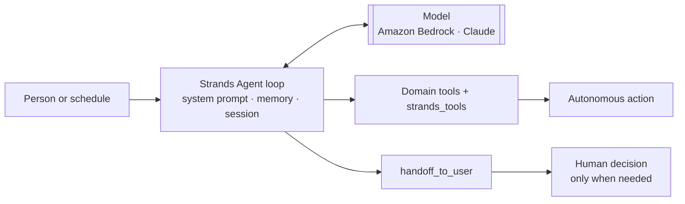

# Agents for Humans · Strands agent

[](https://github.com/alejandro-publius/agents-for-humans/actions/workflows/ci.yml)

Our entry for the [Agents for Humans Hackathon](https://agentsforhumans.devpost.com/) (AWS · Devpost).
An AI agent built on the [Strands Agents SDK](https://strandsagents.com/) that takes a repetitive task
off a person's plate, handles it end to end in the background, and only surfaces when a decision
genuinely needs a human.

> **Status: skeleton.** The agent loop, tool wiring, model-provider switch, offline test harness,
> and CI are in place. The domain (which task, for whom) is still to be chosen: see `docs/ideas.md`.
> Submission deadline is **Sept 14, 2026, 5:00 pm PDT**; the full checklist is in `SUBMISSION.md`.

## What it does

_TODO: one paragraph. Who is the person, what repetitive task do they lose time to, what does the
agent do autonomously, and when does it hand a decision back to them._

## Quickstart

Prerequisites: [uv](https://docs.astral.sh/uv/) and AWS credentials with
[Amazon Bedrock model access](https://docs.aws.amazon.com/bedrock/latest/userguide/model-access.html)
for Claude in `us-west-2` (the default region). uv installs Python 3.12 for you.

```bash
git clone https://github.com/alejandro-publius/agents-for-humans.git
cd agents-for-humans
uv sync --all-groups
cp .env.example .env        # then fill in credentials, or run `aws configure`

uv run afh "How many days until 2026-09-14?"   # one task
uv run afh                                     # interactive REPL
uv run afh --session nightly "Check what's due"   # persist state under .sessions/nightly
```

### Model providers

Bedrock is the default and what the judges expect. Others are optional extras.

| `AFH_MODEL_PROVIDER` | Install | Credentials | Default model |
| --- | --- | --- | --- |
| `bedrock` (default) | included | AWS credentials / Bedrock API key | `global.anthropic.claude-sonnet-4-6` |
| `anthropic` | `uv sync --extra anthropic` | `ANTHROPIC_API_KEY` | `claude-opus-5` |
| `openai` | `uv sync --extra openai` | `OPENAI_API_KEY` | set `AFH_MODEL_ID` |
| `ollama` | `uv sync --extra ollama` | none (local) | set `AFH_MODEL_ID` |

Override the model with `AFH_MODEL_ID`. All variables are documented in `.env.example`.

## Project layout

```
src/afh_agent/
  agent.py          build_agent(): system prompt, tools, memory, session persistence
  models.py         build_model(): provider switch driven by environment variables
  config.py         Settings loaded from the environment
  cli.py            `afh` command: one-shot or REPL
  tools/            domain tools (@tool functions). Add yours to DOMAIN_TOOLS.
tests/
  fake_model.py     ScriptedModel: runs the real agent loop offline, no credentials
  test_agent_offline.py, test_tools.py
docs/
  architecture.md   diagram (required Devpost deliverable) and component map
  ideas.md          track descriptions and a decision template for picking the task
deploy/
  agentcore_app.py  optional Amazon Bedrock AgentCore Runtime entrypoint
SUBMISSION.md       everything Devpost requires, with deadlines and judging criteria
```

## Development

```bash
uv run pytest -q          # offline: the agent loop runs against a scripted model
uv run ruff check .       # lint
uv run ruff format .      # format
```

**Adding a tool.** Write a typed function with a Google-style docstring in `src/afh_agent/tools/`,
decorate it with `@tool`, and append it to `DOMAIN_TOOLS`. Strands derives the tool schema from the
signature and docstring, so the docstring is what the model reads to decide when to call it.
Test the function directly (it stays callable), then script a turn in `tests/fake_model.py` to
assert the agent actually calls it and gets a `success` tool result.

## Architecture



Full diagram and component map: `docs/architecture.md`.

## Deploying to Amazon Bedrock AgentCore (optional)

A live deployment strengthens the Technical Implementation score. The entrypoint is
`deploy/agentcore_app.py`; steps are in its docstring and in the
[AgentCore quickstart](https://aws.github.io/bedrock-agentcore-starter-toolkit/user-guide/runtime/quickstart.html).

## Team

Alex Vintera · Rachel Selbrede

## License

[MIT](LICENSE)
