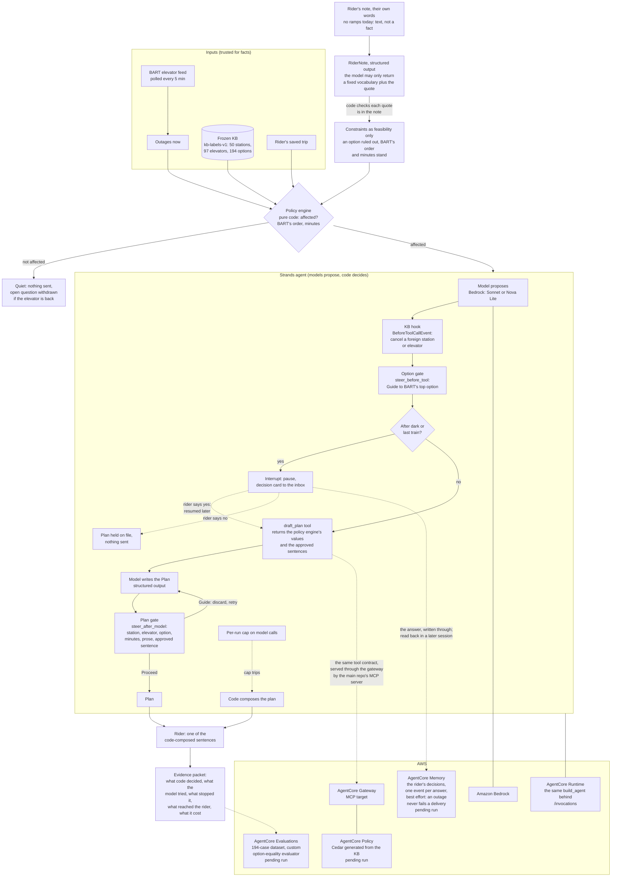
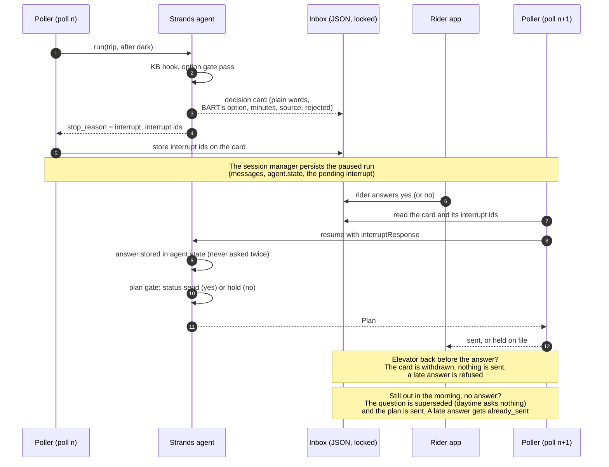

# Architecture of the dispatch package

Two diagrams, both rendered by GitHub. The first is one poll for one
rider: where code decides, where the model proposes, where each gate
sits, and what reaches the rider; the rider's note enters outside the
trusted inputs, as text, and becomes a constraint only through the fixed
vocabulary and the quote check. The second is the human moment across
processes: the poller pauses, the app answers, a later poll resumes.
AgentCore Policy, Evaluations and Memory are shown where they attach and
are labelled pending until the laptop runs them.

## One poll, one rider

What the shapes mean: the diamond decisions are code and never a model;
the model appears twice (proposing a tool call, writing the Plan) and is
gated both times; the dotted cap is the bound the SDK does not provide
(`docs/UPSTREAM-NOTE.md`); the Cedar policy at the gateway is the
in-process hook's twin, enforcing the same rule outside the process for
the tool when the main repo's MCP server serves it through the gateway
(in this package the tool runs in-process, behind the hook).

## The human moment across processes

The sequence is the one `test_pause_and_resume_across_processes_with_file_session_manager`
runs in three processes with a `FileSessionManager`, and the runtime
entrypoint (`infra/agentcore/runtime/entrypoint.py`) exposes as the
`pending`, `sent`, `held`, `withdrawn` and `already_sent` states; an
answer never returns an error (a double tap, a changed mind and an
answer to a question this container never asked each get a plain state
back).
