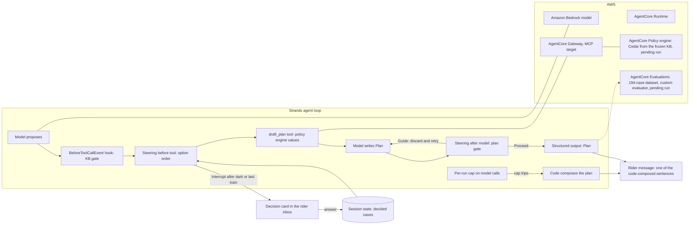

# Architecture diagram additions (keep the diagram honest)

The diagram in `docs/architecture.mmd` must show the user interface, the
Strands agent and its loop (model to tools to reasoning to response),
tools and integrations, AWS services, and output. F1, F2, F5 and F6 add
the nodes below. Policy and Evaluations shipped code in this package, so
they belong on the diagram, labelled "pending run" until the laptop runs
them.

Trace events rendered in `docs/traces/`: hook.cancel_tool,
steering.guide, steering.guide_after_model, steering.proceed_after_model,
interrupt.raised, interrupt.resumed, delivery.composed_by_code.

Two nodes added after F17: the per-run cap on model calls (the SDK's
after-model retry loop is unbounded, so the cap is the only bound) and the
code-composed plan that reaches the rider when the cap trips. The rider
message node now says what it is: one of the sentences code composed from
the policy decision and BART's option text; the model only picks one.
