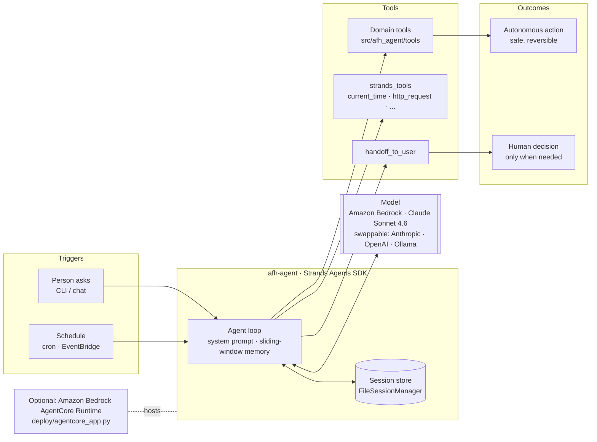

# Architecture

> A diagram is a **required** Devpost deliverable. Keep this file current, then export it as a PNG
> (GitHub renders Mermaid inline; for the Devpost upload use https://mermaid.live → PNG).

## Flow

1. **Trigger.** A person gives the agent a task (`uv run afh "..."`) or a schedule fires it.
2. **Reason.** The Strands agent loop sends the conversation plus tool specs to the model.
3. **Act.** The model calls domain tools (deterministic, unit-tested) until the task is done.
4. **Decide or defer.** Safe steps are taken automatically. Anything irreversible or ambiguous is
   surfaced to the human via `handoff_to_user`, with the options spelled out.
5. **Report.** The agent returns a three-line summary; session state persists for the next run.

## Where things live

| Concern | File |
| --- | --- |
| Operating rules (system prompt), memory, session | `src/afh_agent/agent.py` |
| Model provider switch | `src/afh_agent/models.py` |
| Domain tools | `src/afh_agent/tools/` |
| CLI entrypoint | `src/afh_agent/cli.py` |
| AgentCore deployment entrypoint | `deploy/agentcore_app.py` |
| Offline agent-loop test harness | `tests/fake_model.py` |
