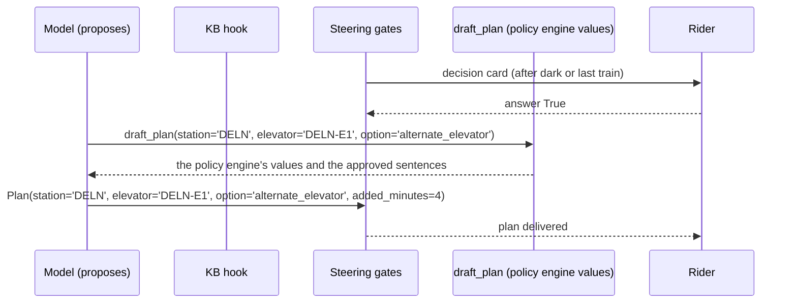

# Evidence packet

Provenance: scripted model, fixture KB (claimable: False).

## Trip and outage

Rider `rider-demo`, DELN to EMBR, elevators out: DELN-E1, after dark.

## What code decided (policy engine, no model)

Affected: True (cannot_enter). Station DELN, elevator DELN-E1. Top option: `alternate_elevator`. Source: https://www.bart.gov/stations/deln/accessible

| Rank | Option | Feasible | Added minutes | Reason |
|---|---|---|---|---|
| 1 | `alternate_elevator` | True | 4 | Use the DELN-E2 elevator on the other side of the platform; ramp connects at concourse level. |
| 2 | `transit` | True | 20 | Take AC Transit or Muni from DELN to the next accessible station; BART honors the fare. |

## What the model tried, and what stopped it

| # | Gate | Tool | Reason |
|---|---|---|---|
| 1 | run paused for the rider | draft_plan | It is after dark. DELN elevator DELN-E1 is out at your starting station. BART's option is the alternate elevator route at the same station, about 4 minutes more. Send this plan now? |
| 2 | rider answered, run resumed | draft_plan | True |
| 3 | draft_plan ran (the policy engine's values came back) | draft_plan | tool ran with these arguments |
| 4 | steering accepted the model's plan | Plan | plan matches |

## The rider was asked

> It is after dark. DELN elevator DELN-E1 is out at your starting station. BART's option is the alternate elevator route at the same station, about 4 minutes more. Send this plan now?

Option `alternate_elevator`, added minutes 4, flags {"after_dark": true, "last_train": false}, source https://www.bart.gov/stations/deln/accessible.

Rejected: `transit` (Take AC Transit or Muni from DELN to the next accessible station; BART honors the fare.).

Answer: True

## What reached the rider

```json
{
  "station": "DELN",
  "elevator": "DELN-E1",
  "option": "alternate_elevator",
  "added_minutes": 4,
  "rider_message": "DELN elevator DELN-E1 is out at your starting station. Use the alternate elevator route at the same station; about 4 minutes more.",
  "status": "send"
}
```

## Run



## Trace events

```
interrupt.raised               span=execute_tool draft_plan
interrupt.resumed              span=execute_tool draft_plan
steering.proceed_after_model   span=execute_event_loop_cycle
```

Counts: hook cancels 0, guides before the tool 0, guides after the model 0, proceeds 1, interrupts 1, model calls 2.
Cost of this decision: 2 model call(s), 2 input and 2 output tokens (4 total), 3 event-loop cycle(s), as reported by the provider through Strands' metrics.
