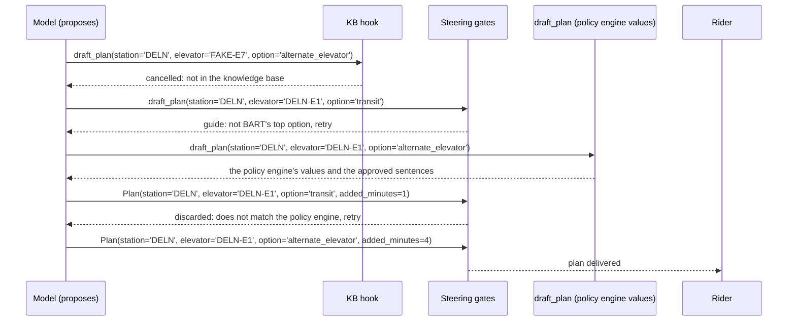

# Evidence packet

Provenance: scripted model, fixture KB (claimable: False).

## Trip and outage

Rider `rider-demo`, DELN to EMBR, elevators out: DELN-E1.

## What code decided (policy engine, no model)

Affected: True (cannot_enter). Station DELN, elevator DELN-E1. Top option: `alternate_elevator`. Source: https://www.bart.gov/stations/deln/accessible

| Rank | Option | Feasible | Added minutes | Reason |
|---|---|---|---|---|
| 1 | `alternate_elevator` | True | 4 | Use the DELN-E2 elevator on the other side of the platform; ramp connects at concourse level. |
| 2 | `transit` | True | 20 | Take AC Transit or Muni from DELN to the next accessible station; BART honors the fare. |

## What the model tried, and what stopped it

| # | Gate | Tool | Reason |
|---|---|---|---|
| 1 | KB hook cancelled the tool call | draft_plan | Cancelled: elevator='FAKE-E7' is not an elevator in the knowledge base; the affected station is 'DELN' and the elevator that is out is 'DELN-E1'. Use only stations and elevators from the knowledge base. |
| 2 | steering guided the tool call (wrong option) | draft_plan | BART's published order puts 'alternate_elevator' first for this outage; 'transit' is not the policy engine's top feasible option. Call draft_plan again with option='alternate_elevator'. |
| 3 | draft_plan ran (the policy engine's values came back) | draft_plan | tool ran with these arguments |
| 4 | steering discarded the model's plan | Plan | Plan rejected: option 'transit' is not the policy engine's top feasible option 'alternate_elevator'; added_minutes 1 did not come from the policy engine (expected 4). Re-issue the Plan with the policy engine's values. |
| 5 | steering accepted the model's plan | Plan | plan matches |

## What reached the rider

```json
{
  "station": "DELN",
  "elevator": "DELN-E1",
  "option": "alternate_elevator",
  "added_minutes": 4,
  "rider_message": "DELN elevator DELN-E1 is out at your starting station. Use the alternate elevator route at the same station; about 4 minutes more.",
  "status": "send"
}
```

## Run



## Trace events

```
hook.cancel_tool               span=execute_tool draft_plan
steering.guide                 span=execute_tool draft_plan
steering.guide_after_model     span=execute_event_loop_cycle
steering.proceed_after_model   span=execute_event_loop_cycle
```

Counts: hook cancels 1, guides before the tool 1, guides after the model 1, proceeds 1, interrupts 0, model calls 5.
Cost of this decision: 5 model call(s), 5 input and 5 output tokens (10 total), 4 event-loop cycle(s), as reported by the provider through Strands' metrics.
