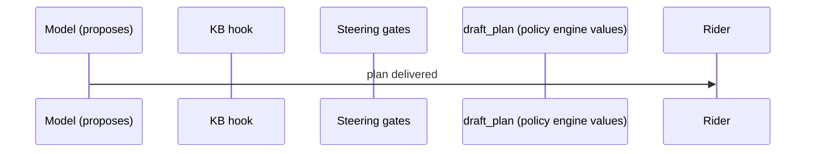

# Evidence packet

Provenance: live model us.anthropic.claude-sonnet-4-5-20250929-v1:0 in us-west-2, fixture KB; composed_by=code (claimable: False).

## Trip and outage

Rider `rider-live`, DELN to EMBR, elevators out: DELN-E1.

## What code decided (policy engine, no model)

Affected: True (cannot_enter). Station DELN, elevator DELN-E1. Top option: `alternate_elevator`. Source: https://www.bart.gov/stations/deln/accessible

| Rank | Option | Feasible | Added minutes | Reason |
|---|---|---|---|---|
| 1 | `alternate_elevator` | True | 4 | Use the DELN-E2 elevator on the other side of the platform; ramp connects at concourse level. |
| 2 | `transit` | True | 20 | Take AC Transit or Muni from DELN to the next accessible station; BART honors the fare. |

## What the model tried, and what stopped it

| # | Gate | Tool | Reason |
|---|---|---|---|

## What reached the rider

```json
{
  "station": "DELN",
  "elevator": "DELN-E1",
  "option": "alternate_elevator",
  "added_minutes": 4,
  "rider_message": "DELN elevator DELN-E1 is out at your starting station. Use the alternate elevator route at the same station; about 4 minutes more.",
  "status": "send"
}
```

## Run



Counts: hook cancels 0, guides before the tool 0, guides after the model 0, proceeds 0, interrupts 0, model calls 1.
Cost of this decision: 1 model call(s), 0 input and 0 output tokens (0 total), 1 event-loop cycle(s), as reported by the provider through Strands' metrics.
